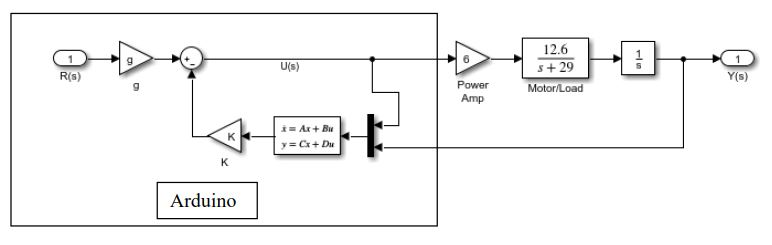
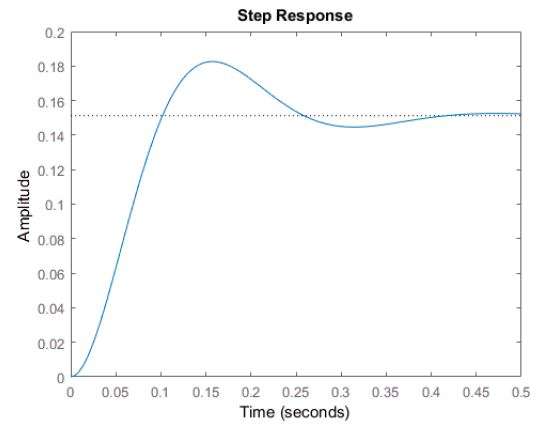
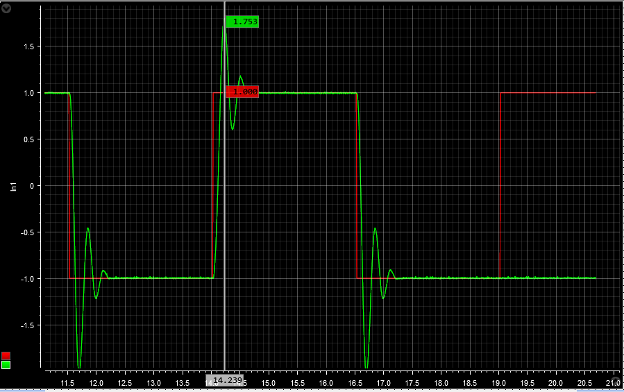
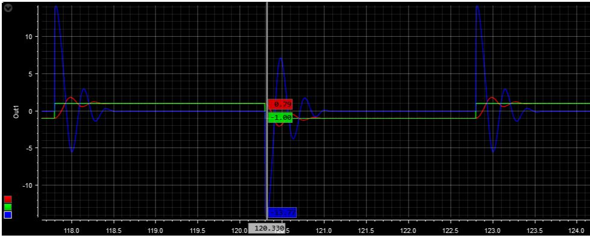

# Observer Feedback Control System with Arduino

 >*PWM-based observer feedback DC motor control implemented on Arduino UNO*
<br/> 

### Developing an Observer and a Controller

The implementation of observer feedback control with the Arduino. The analog implementation of an
observer feedback is fairly complex. Therefore, these systems are typically implemented digitally.

Considering the following system, we will design an observer feedback system for controlling the
position of the system. Assume the closed loop state feedback poles at:
-10+/-j20 and the observer poles at -40+/-j40.


**Figure 1.** Experimental model

Our goal is to find the state-space representation of the controllerwhich we will implement with Arduino
microcontroller.

```matlab
s = tf('s');

Plant = 6*12.6/(s^2+29*s)
state_poles = [-10+1i*20 -10-1i*20]
obs_poles = [-40+1i*40 -40-1i*40]

% SS Model of the Plant
[A,B,C,D] = tf2ss([0 0 75.6],[1 29 0])

% Control Gains
K = place(A,B,state_poles)
eig(A-B*K) % sanity check 

% Feedforward Gain
g = -1/(C*inv(A-B*K)*B)

%% Develop the Observer
syms s g1 g2;
G = [g1; g2];

eqn = collect(det(s*eye(2)-A+G*C))

desired_char = simplify((s-obs_poles(1))*(s-obs_poles(2)))
g2 = double(solve(378*g2/5+29==80,g2))
g1 = double(solve(378*g1/5+10962*g2/5==3200,g1))

G = [g1; g2]
F = A-G*C
H = B

eig(A-G*C) % sanity check

G = place(A',C',obs_poles)'

damp(-10+20j)
% dampig ratio for the poles = 0.447
percent_overshoot = 100*exp(-pi*.447/sqrt(1-.447^2))

% step response
step(ss(A-B*K,B,C,D))
stepinfo(ss(A-B*K,B,C,D))

%% For the Arduino controller part
Ac = A-G*C
Bc = [B G]
```

According to Matlab simulation, the given observer and state feedback poles would give us the following response.


**Figure 2.** Predicted step response

### Programming an Arduino

```c
/***************************************
*                                      *
*   Observer Feedback Control System   *
*                                      *
****************************************/

 float r = 0.5;
 float Ts = 0.01;
 float tt = 0;
 float current_time, previous_time, elapsed_time;

 long count = 0;
 
 float x1_hat = 0;
 float x2_hat = 0;
 
 float u = 0;
 float y = 0;
 int dutyCycle  = 0;

 float a11 = -29;
 float a12 = -1721;
 float a21 = 1;
 float a22 = -51;

 float b11 = 1;
 float b12 = 22.76;
 float b21 = 0;
 float b22 = 0.675;

 float k1 = -9;
 float k2 = 500;
 float g = 6.614;

void setup(){
  
  pinMode(5,OUTPUT); 
  TCCR2B=(TCCR2B&0xF8) | 2;
  pinMode(3,OUTPUT);
  Serial.begin(9600);
}
 
void loop(){

  //current_time = millis(); // get current time
  
  // design a squarewave reference signal
  count = count +1;
  if(count == 100){
    r = -r;
    count = 0;
  }

  // read analog feedback signal
  y = analogRead(A1);
  
  // range for y is -1...6V
  y = (float)(7*y/1023-1);
  
  // develop states of the controller
  x1_hat = x1_hat + Ts*(a11*x1_hat+a12*x2_hat+b11*u+b12*y);
  x2_hat = x2_hat + Ts*(a21*x1_hat+a22*x2_hat+b21*u+b22*y);

  // control signal
  u = -(k1*x1_hat+k2*x2_hat)+g*r;
  u = bound(u,-15,15);
  
  // design a pwm output
  // -15V -> 0
  // 15V -> 255
  dutyCycle=round(255/30*u+255/2);
  
  analogWrite(3,dutyCycle);
  Serial.print(x1_hat*4.2);// velocity
  Serial.print('\t');
  Serial.print(x2_hat*75);//displacement
  Serial.print('\n');

  //Serial.print("\t\t");
  //Serial.print(tt);
  //Serial.print('\n');
  delay(10);
  //elapsed_time = millis() - current_time;
  //Serial.print("\t\telapsed_time = "); Serial.print(elapsed_time);
  //Serial.print("\t\tserial port time = "); Serial.print(millis()-current_time);
  //Serial.print("\n");
}
           
float bound(float x, float x_min, float x_max){
  if(x < x_min){x = x_min;}
  if(x > x_max){x = x_max;}
  return x;
}

// end
```

### Experimental Response


**Figure 3.** Squarewave displacement response 
<br/> 


**Figure 4.** Squarewave velocity response (green &ndash; reference, red &ndash; displacement, blue &ndash; velocity)
<br/> 

--- end ---


